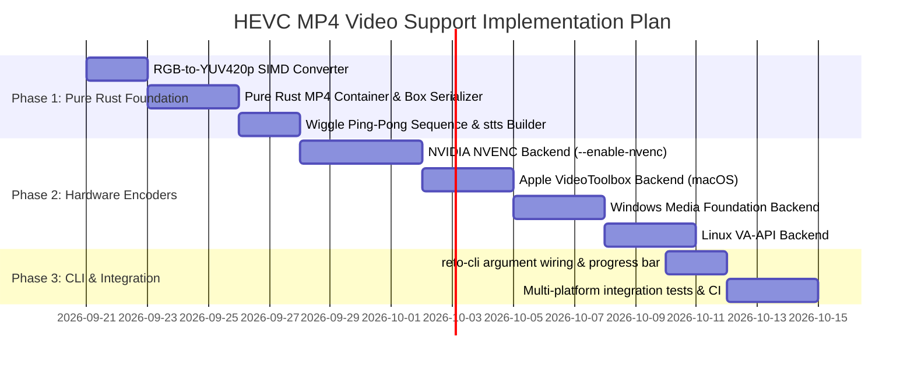

# Wiggle-3D HEVC MP4 Video Export Architecture & Implementation Plan

## 1. Executive Summary & Purpose

While animated GIF remains the universal legacy format for stereoscopic wiggle-grams, it is constrained by an 8-bit indexed palette (256 colors maximum) and inefficient inter-frame raster compression. 

This document defines the architecture for **native 24-bit TrueColor HEVC (H.265) video export in an MP4 container**, enabled via the `--enable-mp4` CLI flag. The implementation adheres to the following core tenets:

1. **HEVC (H.265) Exclusive Video Codec**: Optimized specifically for stereoscopic parallax motion where small inter-view spatial displacements achieve $10\times\text{--}50\times$ higher compression than GIF.
2. **Platform-Builtin Zero-Dependency Architecture**: Leverages native OS-provided encoders (Apple VideoToolbox on macOS, Media Foundation on Windows, VA-API on standard Linux) without bundling heavy third-party C/C++ compiler toolchains.
3. **Explicit Hardware NVENC Acceleration (`--enable-nvenc`)**: Provides a dedicated, high-performance hardware encoding path for NVIDIA GPUs on Linux/WSL and Windows via dynamic loading of `libnvidia-encode.so.1` / `nvEncodeAPI64.dll` (default: **disabled**).
4. **Pure Rust MP4 Container Multiplexer**: Encapsulates HEVC Annex B / AVCC NAL units into standards-compliant ISO Base Media File Format (`.mp4`) using pure Rust crates (e.g. `mp4`), guaranteeing 100% Rust memory safety for container layout and metadata serialization.
5. **Calibrated $\mathrm{SE}(3)$ Variable Timing Preservation**: Directly translates per-frame adaptive delays ($\Delta t_i$) derived from camera baseline extrinsics into MP4 Time-to-Sample (`stts`) atoms.

---

## 2. High-Level Architecture & Pipeline Flow

```mermaid
flowchart TD
    A["Aligned RGBA Sub-Frames [F0, F1, F2]"] --> B["Wiggle Loop Generator (0 -> 1 -> 2 -> 1 ... N Loops)"]
    B --> C["RGB-to-YUV420p Color Space Converter (BT.709 Matrix)"]
    C --> D{"CLI Encoder Selector"}
    
    D -->|--enable-nvenc (True)| E["NVIDIA NVENC Backend (libnvidia-encode)"]
    D -->|macOS| F["Apple VideoToolbox Backend (VTCompressionSession)"]
    D -->|Windows| G["Windows Media Foundation Backend (IMFTransform)"]
    D -->|Linux (Default)| H["Linux VA-API Backend (libva.so.2)"]
    
    E & F & G & H --> I["HEVC NAL Units (SPS, PPS, VPS, IDR/P-Frames)"]
    I --> J["Pure Rust MP4 Muxer (mp4 crate)"]
    K["Adaptive SE(3) Delays (stts Atom)"] --> J
    J --> L["Output File (*.mp4 - 24-bit TrueColor)"]
```

---

## 3. Core Trait Abstraction & Modularity (`reto-core::video`)

To keep `reto-core` modular, clean, and testable, video encoding is decoupled through a dedicated backend trait:

```rust
/// Abstract hardware/software HEVC video frame encoder.
pub trait HevcFrameEncoder: Send {
    /// Initializes the encoder with resolution, target bitrate, and GOP structure.
    fn initialize(&mut self, config: &HevcEncoderConfig) -> Result<(), VideoError>;

    /// Encodes a single YUV420p video frame and returns generated NAL units.
    fn encode_frame(&mut self, frame: &Yuv420PlanarFrame, is_keyframe: bool) -> Result<Vec<HevcNalUnit>, VideoError>;

    /// Flushes delayed B/P frames from the hardware pipeline at end-of-stream.
    fn flush(&mut self) -> Result<Vec<HevcNalUnit>, VideoError>;
}

/// Metadata and parameter configuration for the HEVC encoder.
#[derive(Debug, Clone)]
pub struct HevcEncoderConfig {
    pub width: u32,
    pub height: u32,
    pub fps: u32,
    pub bit_depth: u8,            // 8-bit (Main) or 10-bit (Main10)
    pub crf_or_bitrate: u32,      // Quality target (e.g. CRF 18 for pristine fidelity)
    pub gop_size: u32,            // Keyframe interval
    pub timing_delays_ms: Vec<u32>, // Per-frame display durations (SE(3) adaptive timing)
}
```

---

## 4. Platform-Specific Encoder Backends

### 4.1. macOS / iOS: Apple VideoToolbox
* **Implementation**: Uses `VTCompressionSessionCreate` with `kCMVideoCodecType_HEVC`.
* **Zero External Dependencies**: Links against system frameworks:
  ```toml
  [target.'cfg(target_os = "macos")'.dependencies]
  video-toolbox-sys = "0.2"
  core-foundation = "0.9"
  core-media = "0.1"
  ```
* **Performance**: Direct hardware execution on Apple Silicon M-series Media Engine (sub-millisecond encoding latency).

### 4.2. Windows: Windows Media Foundation (MF)
* **Implementation**: Uses `MFCreateSinkWriterFromURL` or `IMFTransform` configured with `MFVideoFormat_HEVC`.
* **Zero External Dependencies**: Links against standard Windows SDK DLLs via `windows-rs`:
  ```toml
  [target.'cfg(target_os = "windows")'.dependencies]
  windows = { version = "0.58", features = ["Win32_Media_MediaFoundation", "Win32_Foundation"] }
  ```

### 4.3. Linux (Default): VA-API (`libva.so.2`)
* **Implementation**: Dynamic runtime binding to `libva.so.2` and `libva-drm.so.2` with `VAProfileHEVCMain`.
* **Target Hardware**: Intel QuickSync and AMD Radeon VCN graphics on desktop Linux.
* **Graceful Degradation**: If `libva.so.2` or DRM device nodes are unavailable, yields a clean error with an actionable suggestion to use GIF or `--enable-nvenc`.

### 4.4. NVIDIA NVENC (`--enable-nvenc`)
* **Scope**: Linux (including WSL2) and Windows.
* **CLI Flag**: `--enable-nvenc` (Default: **disabled / false**).
* **Implementation**:
  * Dynamically loads `libnvidia-encode.so.1` (Linux/WSL) or `nvEncodeAPI64.dll` (Windows) via `libloading` or direct FFI.
  * Configures `NV_ENC_INITIALIZE_PARAMS` with `NV_ENC_CODEC_HEVC_GUID` and `NV_ENC_PRESET_P7` (highest visual fidelity).
  * Feeds raw YUV420p buffers directly to the GPU encoder without CPU rasterization bottlenecks.

---

## 5. Pure Rust MP4 Multiplexer Integration

To avoid C-library dependencies (like `libavformat` or `gpac`) for container formatting, container generation is handled entirely in pure Rust:

### 5.1. MP4 Box / Atom Structure for HEVC Wiggle Animation
The pure Rust [`mp4`](https://crates.io/crates/mp4) crate is used to construct the ISO BMFF container:

```text
[ftyp] -> major_brand: "mp42", compatible_brands: ["isom", "mp42", "hvc1"]
[moov]
  ├── [mvhd] -> Movie header (duration, timescale: 1000)
  └── [trak] -> Video Track
        └── [mdia]
              ├── [mdhd] -> Media header
              ├── [hdlr] -> Handler ("vide")
              └── [minf]
                    ├── [vmhd] -> Video media header
                    ├── [stbl] -> Sample Table
                    │     ├── [stsd] -> Sample Description ([hvc1] with HEVCDecoderConfigurationRecord / hvcC)
                    │     ├── [stts] -> Time-to-Sample (Injects adaptive non-uniform delays Δt_i)
                    │     ├── [stss] -> Sync Sample Table (Keyframe indices)
                    │     ├── [stsc] -> Sample-to-Chunk mapping
                    │     ├── [stsz] -> Sample size table
                    │     └── [stco] / [co64] -> Chunk offset table
[mdat] -> Raw HEVC elementary stream byte payload
```

### 5.2. Non-Uniform $\mathrm{SE}(3)$ Timing Mapping (`stts`)
Because `stts` records the duration of each individual frame in timescale units (e.g. milliseconds where timescale = 1000), our adaptive $\mathrm{SE}(3)$ timing is encoded directly:
* $\text{Frame}_0 \to \text{Frame}_1$: `sample_delta = 133` ($133\text{ ms}$)
* $\text{Frame}_1 \to \text{Frame}_2$: `sample_delta = 67` ($67\text{ ms}$)

This provides perfectly smooth playback without artificial frame duplication or rate stretching.

---

## 6. CLI Interface & Configuration Design

### 6.1. CLI Arguments in `reto-cli`

```rust
#[derive(Parser, Debug)]
pub struct CliArgs {
    // --- Existing Arguments ---
    #[arg(short, long)]
    pub input: Vec<PathBuf>,

    // --- New Video & Codec Flags ---
    /// Enable 24-bit TrueColor HEVC MP4 video generation alongside GIF
    #[arg(long = "enable-mp4", default_value_t = false)]
    pub enable_mp4: bool,

    /// Enable NVIDIA NVENC hardware encoder for HEVC MP4 generation (requires NVIDIA driver)
    #[arg(long = "enable-nvenc", default_value_t = false)]
    pub enable_nvenc: bool,

    /// Number of continuous ping-pong wiggle loop cycles encoded into the MP4 video (default: 4)
    #[arg(long = "mp4-loops", default_value_t = 4)]
    pub mp4_loops: usize,

    /// Quality / Constant Rate Factor for HEVC encoding (0-51, lower is higher quality, default: 18 for high photometric fidelity)
    #[arg(long = "mp4-crf", default_value_t = 18)]
    pub mp4_crf: u32,
}
```

### 6.2. User Experience & Defaults
* **Default Run (`reto -i scan.jpg`)**: Outputs high-quality calibrated animated `.gif`.
* **MP4 Run (`reto -i scan.jpg --enable-mp4`)**: Outputs both `.gif` and `.mp4` using the default OS builtin encoder.
* **NVENC Run (`reto -i scan.jpg --enable-mp4 --enable-nvenc`)**: Forces GPU hardware NVENC HEVC encoding.

---

## 7. Phased Implementation Roadmap



### Phase 1: Color Space Conversion & MP4 Container Foundation
1. Implement high-speed parallel RGB-to-YUV420p converter (`reto-core::video::color`) with BT.709 colorimetry.
2. Integrate pure Rust `mp4` muxer module (`reto-core::video::mp4_muxer`) supporting HEVC `hvc1` sample descriptions and `stts` non-uniform time allocations.
3. Construct `WiggleLoopSequence` builder to generate ping-pong frame sequences ($0 \to 1 \to 2 \to 1$) repeated for $N$ loops.

### Phase 2: Hardware Encoder Backends
1. **NVENC (`--enable-nvenc`)**: Implement dynamic runtime symbol loader for `libnvidia-encode.so.1` / `nvEncodeAPI64.dll`.
2. **Apple VideoToolbox**: Implement macOS `VTCompressionSession` wrapper.
3. **Windows Media Foundation**: Implement Windows HEVC SinkWriter / transform wrapper.
4. **Linux VA-API**: Implement VA-API driver session loader.

### Phase 3: CLI Wiring, Diagnostics & Verification
1. Add `--enable-mp4`, `--enable-nvenc`, `--mp4-loops`, and `--mp4-crf` to `reto-cli`.
2. Hook MP4 generation into the asynchronous Stage 3/4 pipeline alongside GIF serialization.
3. Add targeted integration tests and visual inspection verification scripts.
